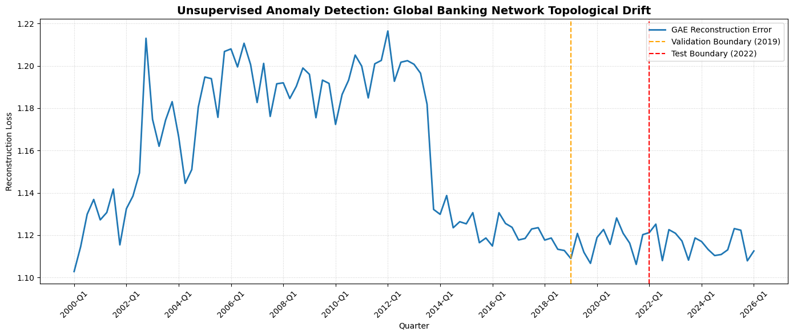
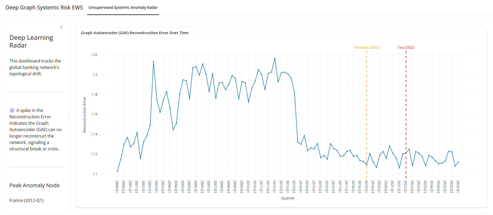

<div align="center">
  <a href="REPORT.md">
    
  </a>
  <p><em>Click the banner to view the full analysis report</em></p>
</div>

# Deep Graph Systemic Risk
### Predicting Global Banking Crises with Spatio-Temporal Graph Neural Networks

<p align="center">
  
  
  
  
  
</p>



---

## Table of Contents
- [Deep Graph Systemic Risk](#deep-graph-systemic-risk)
    - [Predicting Global Banking Crises with Spatio-Temporal Graph Neural Networks](#predicting-global-banking-crises-with-spatio-temporal-graph-neural-networks)
  - [Table of Contents](#table-of-contents)
  - [Overview](#overview)
  - [Project Lineage \& Attribution](#project-lineage--attribution)
  - [Key Results](#key-results)
  - [Project Structure](#project-structure)
  - [Getting Started](#getting-started)
    - [Prerequisites](#prerequisites)
    - [Installation](#installation)
    - [How to Run](#how-to-run)
  - [Data](#data)
  - [Methodology at a Glance](#methodology-at-a-glance)
  - [Dashboard](#dashboard)
  - [Full Report](#full-report)
  - [Contributing](#contributing)
  - [Citation](#citation)
  - [License](#license)
  - [Author \& Contact](#author--contact)
  - [Acknowledgments](#acknowledgments)

---

## Overview

**Deep Graph Systemic Risk** is a deep-learning research project that models the global banking network as an evolving graph and applies **Graph Neural Networks (GNNs)** to detect and forecast systemic financial risk — without any manual feature engineering.

Using **Bank for International Settlements (BIS) Consolidated Banking Statistics** spanning **2000‑Q1 to 2026‑Q1**, the project maps **225 global financial nodes (sovereign economies)** and their bilateral cross-border exposures into a temporal sequence of graphs, then trains two complementary deep learning tracks directly on that topology:

1. An **Unsupervised Graph Autoencoder (GAE)** that learns to reconstruct "normal" banking network topology and flags crises as reconstruction anomalies.
2. A **Spatio-Temporal GNN (ST‑GNN)** — a hybrid GCN + LSTM architecture — that forecasts next-quarter bilateral exposures from a rolling 4-quarter window.

This repository is the **third and final capstone** in a three-part series progressively deepening the analysis of systemic risk in the global banking network — from graph theory and visualization, to explainable machine learning, to native deep graph learning. See [Project Lineage & Attribution](#project-lineage--attribution) below.

For the full write-up — background, motivation, detailed methodology, implementation notes, results, discussion, limitations, and conclusions — see **[REPORT.md](REPORT.md)**.

---

## Project Lineage & Attribution

This repository is the third and final capstone in a series modeling systemic risk in the global banking network. Each project builds directly on the theoretical framework, dataset, and stated future work of the one before it.

| # | Project | Repository | Timeframe & Scale | Contribution |
|---|---------|-------------|---|---------------|
| 1 | **Foundation** | [`visualizing-disruptive-forces`](https://github.com/Sanaurrehmanarain/visualizing-disruptive-forces) | BIS CBS Table B4, 2007‑Q1–2010‑Q4; 207 nodes / 1,761 edges (2008‑Q1 snapshot) | Established the **"Triple-Point" framework** — the intersection of Network Cartography, Causal Inference, and Strategic-Behavioral Game Theory — manually identifying the United Kingdom as the node where structural centrality, causal cascade pathways, and strategic capital flight all converged. Headline finding: just 1% of cross-border lending ties held over 34% of global exposure in 2008‑Q1. |
| 2 | **Machine Learning** | [`ai-systemic-risk-warning`](https://github.com/sanaurrehmanarain/ai-systemic-risk-warning) | BIS CBS, 2007‑Q1–2010‑Q4; 28,265 edges / 16 quarters | Converted Project 1's static Triple-Point framework into a temporal, supervised **Early Warning System** (Logistic Regression baseline → XGBoost at a tuned 15% decision threshold), with SHAP explainability confirming that falling betweenness centrality and capital flight — the same drivers identified qualitatively in Project 1 — are the model's top quantitative predictors of crisis. Explicitly proposed **Temporal Graph Neural Networks** and **unsupervised anomaly detection** as future work. |
| 3 | **This Repository** | [`deep-graph-systemic-risk`](https://github.com/sanaurrehmanarain/deep-graph-systemic-risk) | BIS CBS, 2000‑Q1–2026‑Q1; 225 nodes / 105 quarterly snapshots | Delivers exactly what Project 2 proposed as future work: native **Temporal Graph Neural Networks** and an **Unsupervised Graph Autoencoder**, learning directly from evolving network topology across a 26-year window — six times the timeframe of Projects 1–2 — with zero manually engineered features. |

> **Continuity note:** Project 2's own "Future Work" section named the two exact directions this repository implements — *"Temporal Graph Neural Networks (TGNs): move from tabular XGBoost to deep learning (PyTorch Geometric) that learns directly from evolving network topology"* and *"Unsupervised anomaly detection: use autoencoders to surface novel crisis signatures without relying on binary supervised labels."* This project is that roadmap, executed.

**Suggested citations for the lineage:**

> Arain, S. U. R. (2026). *Visualizing Disruptive Forces in the Global Banking Network: A Multi-Lens Analysis of the 2008 Financial Crisis* (Version 1.0) [Software]. https://github.com/sanaurrehmanarain/visualizing-disruptive-forces
>
> Arain, S. U. R. (2026). *ai-systemic-risk-warning* (Version 1.0) [Software]. https://github.com/sanaurrehmanarain/ai-systemic-risk-warning
>
> Arain, S. U. R. (2026). *deep-graph-systemic-risk* (Version 1.0) [Software]. https://github.com/sanaurrehmanarain/deep-graph-systemic-risk

---

## Key Results

- **Autonomous Crisis Detection:** The GAE, trained only on 2000–2018 data with no crisis labels, autonomously reverse-engineered the timeline of 21st-century systemic crises — spiking reconstruction error during the **2008 Subprime collapse**, the **2011–2012 Eurozone debt crisis**, and the **2020 COVID-19 liquidity shock**.
- **Predictive Forecasting:** The ST-GNN achieved an **Out-of-Sample Test MSE of 0.5981** on the fully unseen 2022–2026 window, demonstrating its viability as a dynamic Early Warning System for future capital flight and edge-weight shifts.
- **Zero Manual Feature Engineering:** Both models learn directly from raw network topology (node degree/strength statistics derived automatically), unlike the tabular XGBoost system in Project 2.



---

## Project Structure

```
deep-graph-systemic-risk/
├── data/
│   ├── processed/
│   │   ├── bis_cbs_full_1983Q4_2026Q1_all_rows.csv
│   │   ├── bis_cbs_full_1983Q4_2026Q1_graph_edges.csv
│   │   ├── bis_cbs_full_1983Q4_2026Q1_observed.csv
│   │   ├── bis_cbs_full_1983Q4_2026Q1_positive_edges.csv
│   │   ├── bis_cbs_full_period_quality.csv
│   │   ├── bis_cbs_full_snapshot_diagnostics.csv
│   │   ├── bis_cbs_graph_edge_data_dictionary.csv
│   │   ├── bis_cbs_node_index.csv
│   │   ├── bis_cbs_quarterly_2000Q1_2026Q1_all_rows.csv
│   │   ├── bis_cbs_quarterly_2000Q1_2026Q1_graph_edges.csv
│   │   ├── bis_cbs_quarterly_2000Q1_2026Q1_observed.csv
│   │   ├── bis_cbs_quarterly_2000Q1_2026Q1_positive_edges.csv
│   │   ├── bis_cbs_quarterly_period_quality.csv
│   │   ├── bis_cbs_quarterly_snapshot_diagnostics.csv
│   │   ├── gae_systemic_anomalies.csv          # GAE output (Notebook 02)
│   │   └── temporal_graph_sequence.pt          # PyG graph sequence (Notebook 01)
│   └── raw/
│       └── WS_CBS_PUB_csv_col.csv              # Original BIS source extract
├── figures/
│   ├── banner.png
│   ├── dashboard.png
│   └── unsupervised_anomaly_detection.png
├── models/
│   └── st_gnn_model.pth                        # Trained ST-GNN weights (Notebook 03)
├── notebooks/
│   ├── 00_data_preprocessing.ipynb             # Cleaning, node indexing, chronological split design
│   ├── 01_pytorch_geometric_data_prep.ipynb    # Builds PyG Data snapshots + scaling
│   ├── 02_unsupervised_graph_autoencoder.ipynb # GAE training + anomaly scoring
│   └── 03_temporal_gnn_predictions.ipynb       # ST-GNN (GCN + LSTM) training + forecasting
├── app.py                                       # Interactive dashboard entry point
├── README.md
├── REPORT.md
├── requirements.txt
└── TASKS.md
```

---

## Getting Started

### Prerequisites

- Python 3.10+
- pip (or conda)
- ~2 GB free disk space for processed data and model artifacts
- (Optional) a CUDA-capable GPU for faster training — the notebooks run on CPU as well

### Installation

```bash
# 1. Clone the repository
git clone https://github.com/sanaurrehmanarain/deep-graph-systemic-risk.git
cd deep-graph-systemic-risk

# 2. Create and activate a virtual environment (recommended)
python -m venv .venv
source .venv/bin/activate      # Windows: .venv\Scripts\activate

# 3. Install dependencies
pip install -r requirements.txt
```

> **Note:** PyTorch Geometric has platform/CUDA-specific install requirements. If `pip install -r requirements.txt` fails on `torch-geometric` or its dependencies (`torch-scatter`, `torch-sparse`), install PyTorch first, then follow the official [PyTorch Geometric installation guide](https://pytorch-geometric.readthedocs.io/en/latest/install/installation.html) matched to your PyTorch/CUDA version before retrying.

### How to Run

The pipeline is designed to be run **in order**, since each notebook consumes the artifacts produced by the previous one:

```bash
jupyter notebook notebooks/
```

1. **`00_data_preprocessing.ipynb`** — Cleans the raw BIS extract, builds the stable 225-node index, applies the log transform, and writes the processed CSVs used downstream.
2. **`01_pytorch_geometric_data_prep.ipynb`** — Converts the processed edge list into a chronological sequence of PyTorch Geometric `Data` snapshots (`temporal_graph_sequence.pt`), fitting the scaler on training data only.
3. **`02_unsupervised_graph_autoencoder.ipynb`** — Trains the GAE on 2000–2018 snapshots and produces `gae_systemic_anomalies.csv`.
4. **`03_temporal_gnn_predictions.ipynb`** — Trains the ST-GNN and saves the trained weights to `models/st_gnn_model.pth`, reporting the out-of-sample test MSE.

Once the artifacts above exist, launch the interactive dashboard:

```bash
python app.py
```

This surfaces the GAE anomaly trajectory and ST-GNN forecasts for exploration, mirroring the static figures in `figures/`.

---

## Data

- **Source:** [Bank for International Settlements (BIS) Consolidated Banking Statistics](https://www.bis.org/statistics/consbankstats.htm), raw extract in `data/raw/WS_CBS_PUB_csv_col.csv`.
- **Coverage:** 1983‑Q4 through 2026‑Q1 in the full dataset; the primary modeling window is the regularly-spaced **quarterly** panel from **2000‑Q1 to 2026‑Q1** (105 snapshots).
- **Nodes:** 225 stable, integer-indexed sovereign economies (`bis_cbs_node_index.csv`), consistent across all periods even when a country is absent in a given quarter.
- **Edges:** Directed bilateral cross-border claims, log-transformed (`log(1 + claim_value)`) to correct for extreme right-skew (raw claims peak near **$2.10 trillion**).
- **Splits (chronological, no shuffling):**

| Split | Period | Edges |
|---|---|---|
| Train | 2000‑Q1 – 2018‑Q4 | 145,145 |
| Validation | 2019‑Q1 – 2021‑Q4 | 30,765 |
| Test | 2022‑Q1 – 2026‑Q1 | 43,089 |

Full rationale for these design choices — including why missing historical quarters were **not** interpolated — is in [REPORT.md § Data & Preprocessing](REPORT.md#4-data--preprocessing).

---

## Methodology at a Glance

| Track | Notebook | Architecture | Objective |
|---|---|---|---|
| **1. Unsupervised GAE** | `02_unsupervised_graph_autoencoder.ipynb` | 2-layer GCN encoder (4 → 16 → 8 dims) + inner-product decoder | Reconstruct bilateral links from 2000–2018 "normal" topology; reconstruction error = anomaly score |
| **2. Spatio-Temporal GNN** | `03_temporal_gnn_predictions.ipynb` | 2-layer GCN + LSTM (hidden dim 32) + MLP edge decoder | Forecast next-quarter edge weights from a rolling 4-quarter window |

Full architectural detail, training configuration, and results discussion live in **[REPORT.md](REPORT.md)**.

---

## Dashboard

`app.py` provides an interactive view over:
- The GAE reconstruction-error trajectory with crisis-period annotations
- ST-GNN forecast vs. actual edge weights on the held-out test window
- Node-level anomaly attribution (which economy contributed most to a quarter's reconstruction error)

---

## Full Report

For the complete analysis — executive summary, background, motivation, objectives, detailed data preprocessing, methodology, implementation, results, discussion, limitations, and conclusion — see **[REPORT.md](REPORT.md)**.

---

## Contributing

Contributions, issues, and suggestions are welcome — this is an active capstone project and feedback is genuinely useful.

**To contribute:**

1. **Fork** the repository and create a feature branch: `git checkout -b feature/your-feature-name`
2. **Set up the environment** following [Installation](#installation) above.
3. **Make your changes.** For code changes, please:
   - Keep notebook execution order-independent side effects out of shared modules where possible.
   - Follow the existing chronological train/val/test convention (no shuffling, no leakage across the split boundary).
   - Add or update docstrings/comments for any new model components.
4. **Test your changes** by re-running the affected notebook(s) end-to-end.
5. **Commit and push:** use clear, descriptive commit messages.
6. **Open a Pull Request** describing the motivation and the change, and link any related issue.

**Ways to contribute beyond code:**
- Report bugs or unexpected results via [Issues](https://github.com/sanaurrehmanarain/deep-graph-systemic-risk/issues).
- Suggest additional macroeconomic node features (interest rates, GDP, reserves) per the Future Work section in the report.
- Improve documentation, add tests, or extend the dashboard (`app.py`).
- Propose alternative architectures (e.g., EvolveGCN, TGAT, DySAT) for benchmarking against the current GAE/ST-GNN baselines.

Please be respectful and constructive in all discussions — this project follows standard open-source etiquette. If a `CODE_OF_CONDUCT.md` is added in the future, it will apply to all contributions.

---

## Citation

If you use this project in academic research, publications, educational materials, or derivative works, please cite it and provide appropriate credit to the original author. A [`CITATION.cff`](CITATION.cff) file is included, so GitHub also provides a **"Cite this repository"** button in the sidebar (BibTeX, APA, and other formats).

**Suggested citation:**

> Arain, S. U. R. (2026). *deep-graph-systemic-risk* (Version 1.0) [Software]. https://github.com/sanaurrehmanarain/deep-graph-systemic-risk

Please also consider citing the two earlier projects in this series (see [Project Lineage & Attribution](#project-lineage--attribution)) if your work builds on their frameworks or outputs.

---

## License

This project is licensed under the **MIT License** — see [LICENSE](LICENSE) for details. The license requires that the original copyright notice be retained in copies of the software.

---

## Author & Contact

| | |
|---|---|
| **Author** | Sana Ur Rehman Arain |
| **Role** | Data Scientist |
| **GitHub** | [@sanaurrehmanarain](https://github.com/sanaurrehmanarain) |
| **Contact** | sana.arain.work@gmail.com |

---

## Acknowledgments

- **Bank for International Settlements (BIS)** for the publicly available Consolidated Banking Statistics that underpin all three projects in this series.
- The **PyTorch Geometric** and **PyTorch** open-source communities.
- Everyone who reviewed, tested, or gave feedback on Projects 1 and 2, whose groundwork made this deep learning capstone possible.

<p align="center">
⭐ If this project was useful to you, consider starring the repo — it helps others discover it and supports future work.
</p>